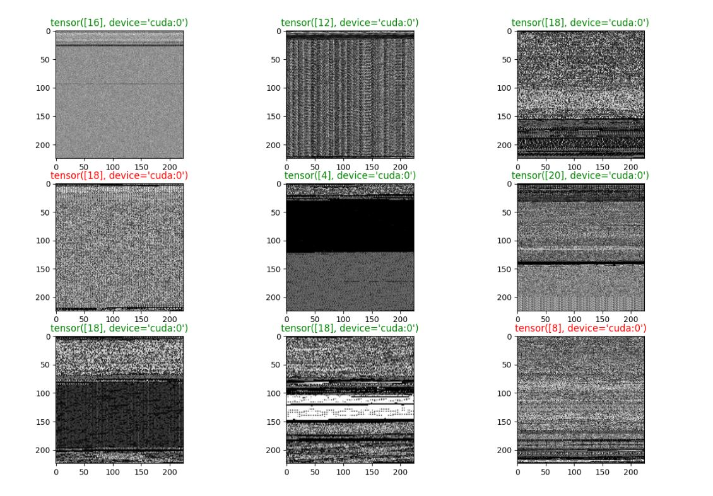
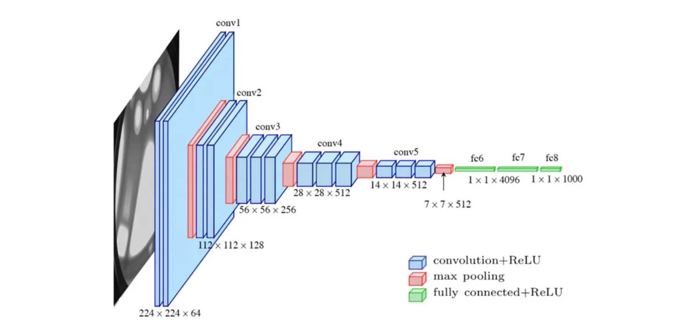

# Malware Classification using Deep Convolutional Neural Networks 

## Overview

The proposed work is used for classification of malware images obtained from Malevis dataset : A Dataset for Vision Based Malware Recognition(https://web.cs.hacettepe.edu.tr/~selman/malevis/)
Malevis dataset involves totally 9100 training and 5126 validation RGB images. All the training classes involve 350 image samples while validation set have various number of images.
The RGB images are converted into grayscale images to reduce better computational complexity of image processing as it involves only a single channel instead of three. 

## Data Visualization

The performance of the model is : Training accuracy - 98.9% , Validation accuracy - 87 %

## Model Architecture

## Future Scope

One of the major future advancements in this work can be to feed the neural network with Binary Executables which are converted into binary images as a part of the preprocessing
and detect whether the executable can produce a backdoor attack on target computer.
